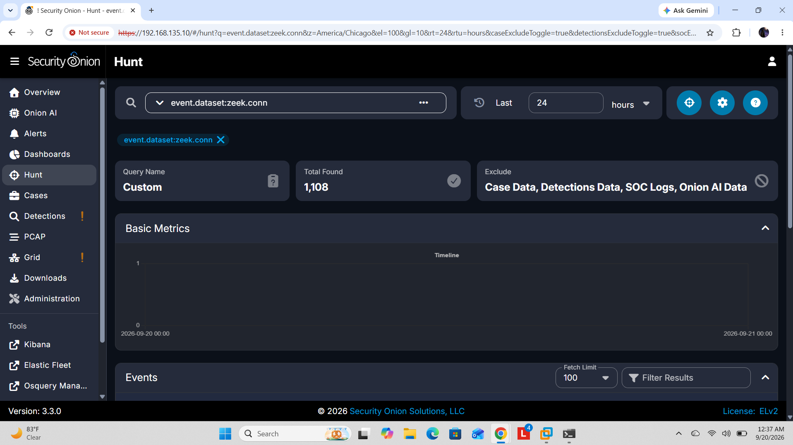

# Security Onion Zeek Ingestion Troubleshooting

**Completed:** September 20, 2026  
**Context:** ITSY 2341 Security Management Practices, Module 04 installation and validation lab

## Outcome

I restored Zeek event visibility in Security Onion Hunt by correcting an Elasticsearch template mapping and rolling over the affected data stream. The final Hunt screenshot shows 1,108 connection events in the selected 24-hour window.

## Environment

| Component | Configuration |
|---|---|
| Hypervisor | VMware Workstation |
| Security Onion | 3.3.0, Evaluation mode |
| VM resources | 4 vCPUs, 9 GB RAM after troubleshooting, 200 GB disk |
| Management address | 192.168.135.10, private lab network |
| Replay interface | bond0 |
| Validation tools | so-status, so-test, Elastic Agent/Fleet, Elasticsearch queries, Hunt |

## Symptom and Investigation

Zeek generated fresh `conn.log` data, but Hunt returned no Zeek connection events. I traced the path from packet replay to log generation, file collection, ingest processing, and indexing.

The investigation documented in my lab report confirmed that replay reached Zeek, Filebeat/filestream read the connection log, and the Zeek ingest pipelines were active. Elasticsearch's failure store contained rejected Zeek documents.

## Root Cause and Resolution

The active template mapped `event.module` as a `constant_keyword` fixed to `filestream`. Incoming events used `event.module = zeek`, causing document parsing failures.

I reloaded the Security Onion Elasticsearch templates, changing the field to a normal `keyword`, and rolled over `logs-zeek-so` so a new backing index used the corrected mapping. I replayed the test traffic and checked indexing and Hunt visibility again.

## Validation

| Check | Recorded result | Evidence |
|---|---|---|
| Packet replay | 55,748 successful packets; 0 failed packets | Completed lab report |
| Zeek indexing | 2,697 documents in logs-zeek-so | Completed lab report |
| Hunt query | event.dataset:zeek.conn | Screenshot below |
| Hunt results | 1,108 connection events, last 24 hours | Screenshot below |

The packet, document, and connection-event counts measure different stages and scopes. They are not counts of attacks detected or incidents resolved.

## What This Demonstrates

- Diagnosing missing telemetry beyond checking whether services are running
- Following data through collection, ingestion, indexing, and search
- Understanding the effect of index templates and data-stream rollover
- Validating a fix with repeatable traffic and a focused query

## Scope and Next Step

This was a lab ingestion-recovery investigation. It did not establish production detection coverage or investigate a real intrusion. The original root-cause and mapping-change screenshots are not included here; those steps are described from my completed lab report.

Next, I plan to investigate selected connection events and document the traffic context, findings, and analyst recommendations.

**Source:** Caleb Morrison, Security Onion Installation & Validation Lab Report, completed September 20, 2026. The included Hunt image is the original captured screenshot.

[Back to labs](../README.md) · [Back to portfolio](../../README.md)
