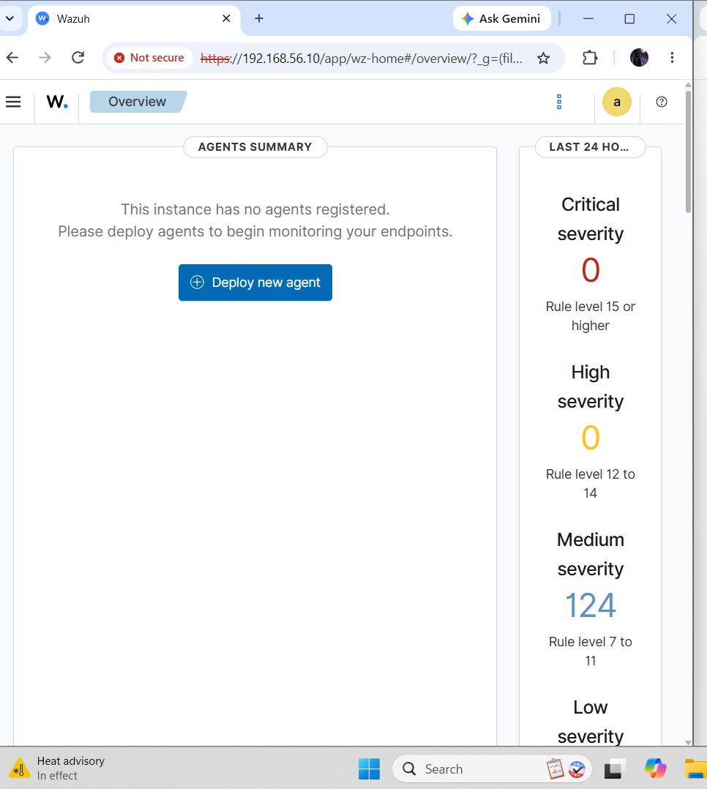

# Wazuh SIEM Deployment

**Status:** Server deployment complete; endpoint monitoring in progress  
**Evidence date:** September 15, 2026

## Outcome

I deployed an all-in-one Wazuh server on Ubuntu and confirmed dashboard access through the private lab network. Installation output recorded startup of the indexer, manager, Filebeat, and dashboard.

## Environment

| Component | Configuration |
|---|---|
| Hypervisor | Oracle VirtualBox |
| Operating system | Ubuntu Server 24.04 LTS |
| VM resources | 4 CPUs, 8 GB RAM, 50 GB disk |
| Internet-facing VM adapter | NAT, enp0s3 |
| Lab adapter | Host-only, enp0s8 |
| Lab management address | 192.168.56.10/24 |
| Planned endpoints | Windows victim and Kali test machine |

## Completed Work

1. Configured the Ubuntu VM and its NAT and host-only networking.
2. Installed the all-in-one Wazuh components.
3. Confirmed service startup in the installation output.
4. Accessed the Wazuh dashboard at the private management address.

## Evidence and Current Limit

The original dashboard screenshot confirms management access and explicitly shows **no agents registered**. Dashboard severity counters alone do not demonstrate endpoint monitoring or a completed attack investigation.

The installation screenshot is omitted because it contained credentials. The dashboard provides direct evidence of access without publishing that credential-bearing output.

## Next Milestone

- Enroll the Windows endpoint and confirm that its agent is active.
- Generate a controlled test event in the lab.
- Match the event to its Wazuh alert and record the source, timestamp, rule, and interpretation.
- Document findings and the response that would be appropriate in an operational setting.

## Skills Demonstrated

SIEM deployment, Linux service setup, virtual networking, and management access validation. Endpoint alert triage and attack simulation remain future work.

[Back to labs](../README.md) · [Back to portfolio](../../README.md)
