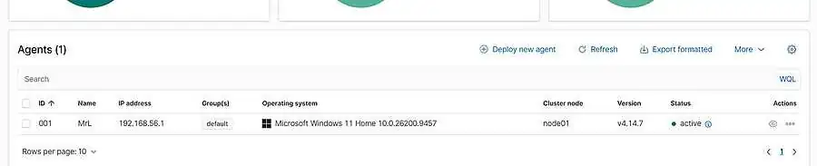
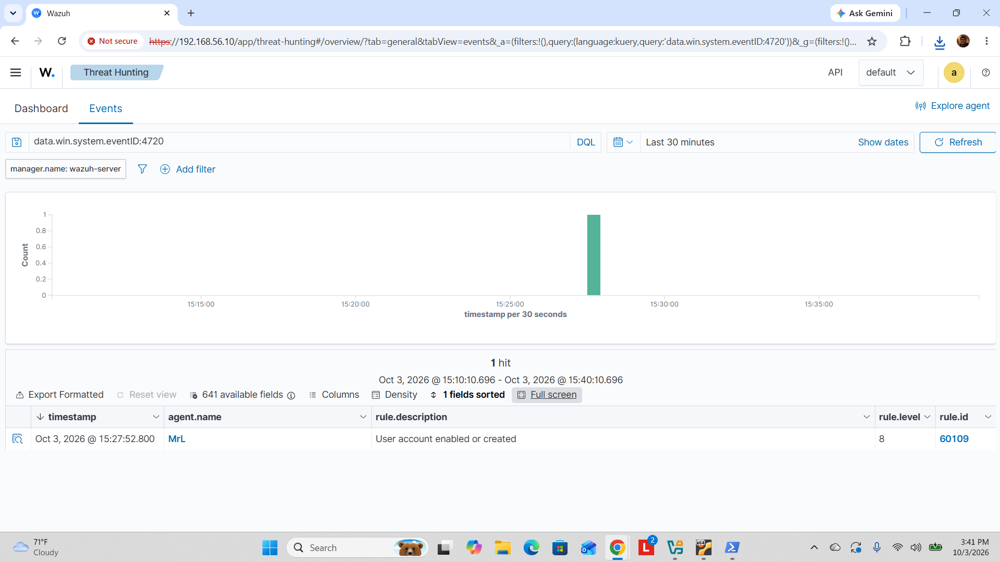
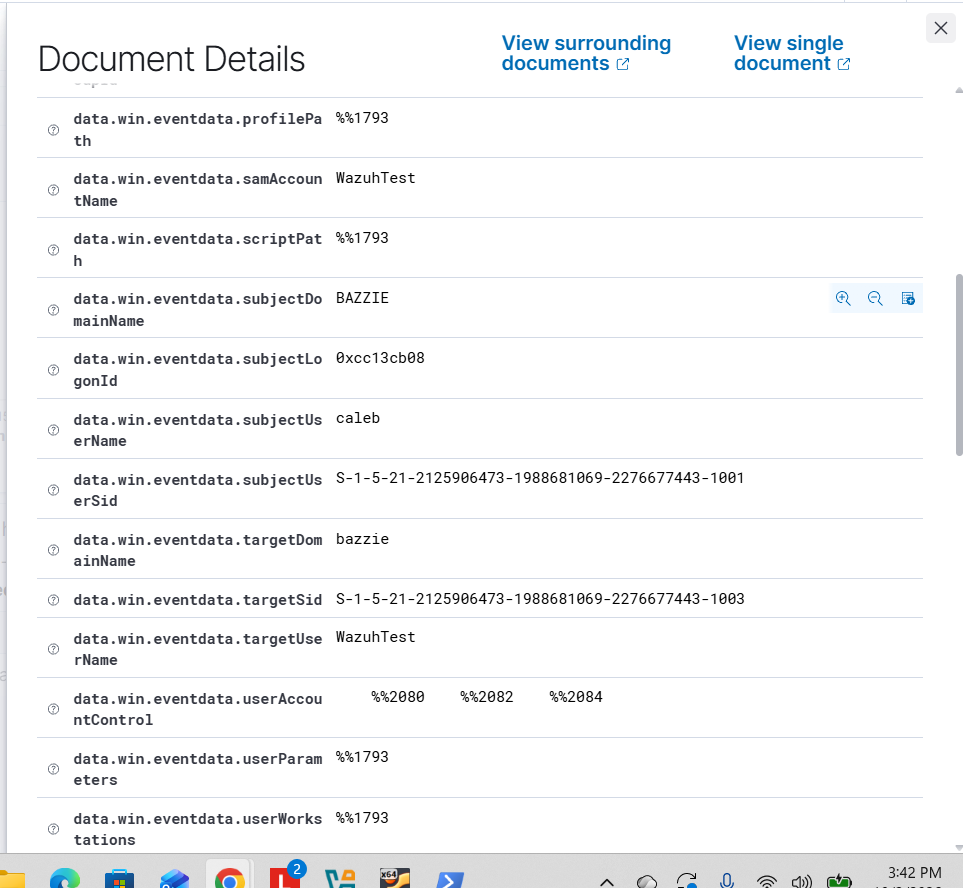

# Wazuh SIEM Deployment and Endpoint Monitoring

**Status:** Windows endpoint enrolled; controlled alert validated  
**Latest evidence date:** October 3, 2026

## Outcome

I deployed an all-in-one Wazuh server on Ubuntu, confirmed dashboard access through the private lab network, enrolled a Windows 11 endpoint, verified the agent reported **Active**, and generated a controlled account-creation event for alert validation.

Wazuh captured Windows Security **Event ID 4720**, which represents a user account being created. The event details exposed the test account and related Windows event fields, demonstrating that endpoint telemetry was flowing from the Windows VM into the SIEM and could be reviewed during triage.

## Environment

| Component | Configuration |
|---|---|
| Hypervisor | Oracle VirtualBox |
| Wazuh server OS | Ubuntu Server 24.04 LTS |
| Server resources | 4 CPUs, 8 GB RAM, 50 GB disk |
| Internet-facing VM adapter | NAT, enp0s3 |
| Lab adapter | Host-only, enp0s8 |
| Lab management address | 192.168.56.10/24 |
| Endpoint | Windows 11 Home VM |
| Wazuh agent | Active in dashboard |
| Controlled test | Local Windows user-account creation |

## Completed Work

1. Configured the Ubuntu VM and its NAT and host-only networking.
2. Installed the all-in-one Wazuh components.
3. Confirmed Wazuh dashboard access on the private management network.
4. Installed and started the Wazuh agent on the Windows VM.
5. Confirmed the Windows endpoint appeared as **Active** in Wazuh.
6. Created a controlled local Windows test account.
7. Located the resulting Windows Security **Event ID 4720** in Wazuh.
8. Reviewed the event details, including the created account fields.

## Evidence

### Windows agent active

The dashboard shows one active Windows endpoint and no disconnected or never-connected agents at the time of capture.

### Controlled alert validation

The controlled test produced a Windows Security **Event ID 4720** alert in Wazuh. The captured event details identified the created test account as **WazuhTest** and showed the associated Windows event fields, including the target user and SID.

The query `data.win.system.eventID:4720` returned one alert from **MrL**, with rule **60109**, description **User account enabled or created**, and rule level **8**.

The account fields show initiating user **caleb** and target account **WazuhTest**. This was an intentional local account-creation test.

Key fields recorded from the screenshots:

| Field | Recorded value |
|---|---|
| Event ID | 4720 (search filter) |
| Alert timestamp | October 3, 2026, 15:27:52.800 (dashboard display; timezone not shown) |
| Agent name / ID | MrL / 001 |
| Wazuh rule ID | 60109 |
| Rule description | User account enabled or created |
| Rule level | 8 |
| Initiating user / domain | caleb / BAZZIE |
| Target user | WazuhTest |
| Target domain | bazzie |
| Target SID | S-1-5-21-2125906473-1988681069-2276677443-1003 |
| Endpoint status | Active (separate dashboard capture) |

## Analyst Interpretation

A 4720 event is security-relevant because account creation can be legitimate administration or a persistence technique depending on context. In an operational SOC, I would correlate the event with the initiating user, host, timestamp, approved change activity, logon history, privilege changes, and any follow-on activity before deciding whether escalation is necessary.

In this lab, the event was generated intentionally to validate collection and triage workflow. It was not a real intrusion.

## Skills Demonstrated

- Wazuh SIEM deployment and dashboard validation
- Windows endpoint-agent installation and enrollment
- Endpoint telemetry verification
- Windows Security event review
- Controlled Event ID 4720 validation
- Alert triage and field interpretation
- Linux service setup and virtual networking
- Evidence-based technical documentation

## Project Bullets

- Deployed Wazuh on Ubuntu Server in VirtualBox and enrolled a Windows 11 endpoint, confirming Active agent status and endpoint connectivity.
- Validated Windows Security log ingestion using a controlled account-creation test; located Event ID 4720 in Wazuh and reviewed the target username, domain, and SID.

## Evidence Limits

The screenshots document one controlled test. The dashboard timestamp does not show a timezone. Rule level 8 is the Wazuh alert level, not a conclusion that this intentional test was malicious.

## Next Step

Add a second controlled scenario, such as a failed-logon burst or another Windows security event, then document the triage decision and recommended response.

[Back to labs](../README.md) · [Back to portfolio](../../README.md)
